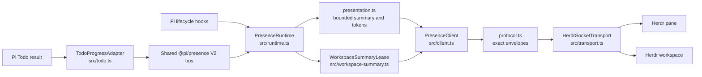
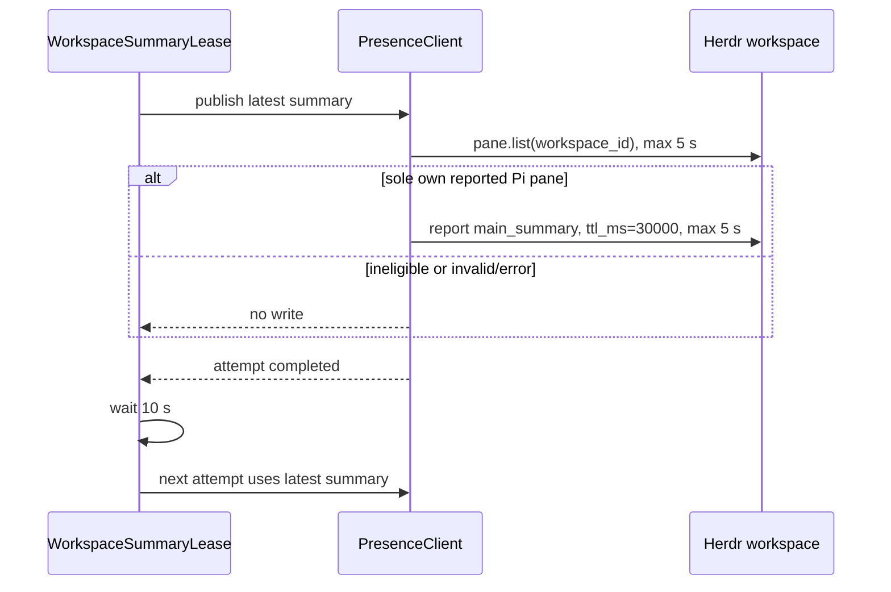
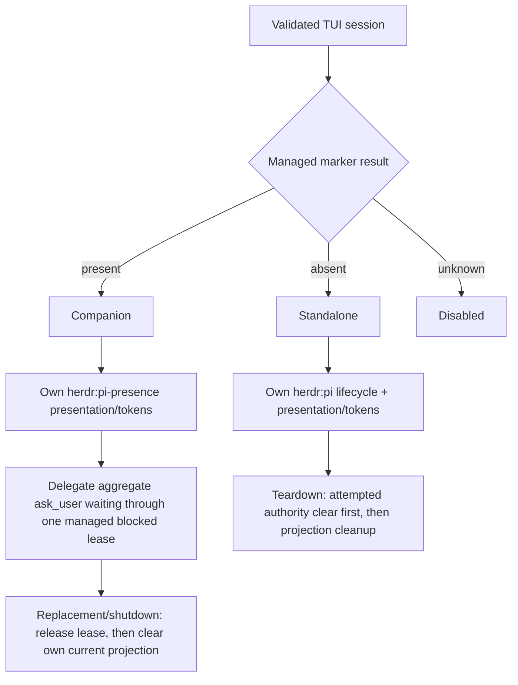

# Architecture and module roles

This document is the authoritative overview of component boundaries and lifecycle ordering. See [configuration](configuration.md) for environment behavior, [event contract](event-contract.md) for Herdr envelopes, and [feature ownership](feature-ownership.md) for authority and privacy limits.

## Components



| Module | Responsibility | Does not own |
| --- | --- | --- |
| `src/runtime.ts` | Pi hook lifecycle, V2 consumer activation, local Pi/Todo producers, aggregate state, startup/teardown fencing, and notification sequencing | Wire encoding or socket I/O |
| `src/workspace-summary.ts` | Immediate and completion-relative workspace-summary lease cadence, timer fencing, and latest-summary retention | Eligibility, wire encoding, or workspace clearing |
| `src/presentation.ts` | Fixed presentation and bounded V2 token/summary projection | Herdr requests or producer protocol semantics |
| `src/client.ts` | Mode-specific pane calls, cleanup ordering, workspace eligibility/read-write flow, and output fencing | Untrusted input parsing or timer scheduling |
| `src/protocol.ts` | Exact request/response schemas, fixed token grammar, and bounded values | Connections, retries, or mode selection |
| `src/transport.ts` | One-request-per-connection Unix-socket exchange, validation, bounded queue, deadlines, and priority cleanup | Request meaning or authority |
| `src/config.ts`, `src/official-hook.ts`, `src/identity.ts` | Configuration parsing, managed-marker detection, and Herdr identity/socket safety | Runtime output after an ambiguous result |
| `src/todo.ts` | One stable Todo owner; structural traversal of `params`/`error` within depth, field, and array-count bounds (not string-byte bounds); task count and allowed-key checks; derives only IDs, statuses, and counts | Traversing ignored task-field values or copying, interpreting, retaining, or projecting task text, arguments, or nested values |
| `src/notification-policy.ts` | Fixed-text notification policy plus bounded transactional dedupe/rate reservations | Producer-provided notification content |

Actionable notifications reserve bounded dedupe/rate capacity at synchronous queue admission. `BoundedSocketQueue` reports one later disposition after it detaches keyed/timer state: `timed_out`, `cancelled`, `pre_dispatch_failure`, `coalesced`, `priority_cleanup`, `actionable_displacement`, and `closed` release the reservation. `pre_dispatch_failure` covers fingerprint, validation, connection, and other pre-write failures. Only a successful physical `socket.write()` commits the reservation; all later outcomes are delivery-unknown and are neither retried nor rolled back. Runtime callbacks are fenced to the captured epoch/client. Input lifecycles retain their exact notification key and a bounded same-session failure fallback only while their input alert is pending; dispatch drops it, while ending a pre-write lifecycle cancels that exact key and a release invokes the fallback after reservation rollback.

## Startup and ordinary projection

The V2 consumer is active before its retained state is projected. Startup keeps ordinary output closed until cleanup, applicable standalone authority, and a stable initial render finish. Pending live notification edges drain, local Pi/Todo producer candidates activate, and pending lifecycle edges replay. The final `idle`/`running` pane state—or, for a replayed pending `agent_start`, that start's final pane state—is synchronously enqueued before the independent workspace eligibility attempt is launched without awaiting it. A stalled `pane.list` therefore cannot delay those local steps.

```mermaid
sequenceDiagram
  participant Pi as Pi hooks / V2 bus
  participant R as PresenceRuntime
  participant C as PresenceClient
  participant H as Herdr pane
  participant W as Herdr workspace

  Pi->>R: session_start
  R->>R: validate identity and managed marker; activate V2 consumer
  R->>C: current metadata clear
  alt standalone
    R->>C: legacy metadata clear, session/state authority
  end
  C->>H: ordered pane requests
  R->>C: initial fixed presentation + ten tokens
  C->>H: pane.report_metadata
  R->>R: open ordinary output; drain queued live notifications
  R->>R: activate local Pi/Todo producer candidates
  alt pending agent_start
    R->>C: replay agent_start; enqueue its final pane state
    C->>H: pane.report_metadata
  else no pending agent_start
    R->>C: enqueue final idle/running pane state
    C->>H: pane.report_metadata
  end
  R-)C: launch workspace-summary attempt (not awaited)
  C->>W: pane.list(workspace_id)
  opt exactly this one reported agent: pi pane
    C->>W: workspace.report_metadata(main_summary, ttl 30 s)
  end
```

`metadata=false` suppresses ordinary live pane metadata and the workspace `main_summary` lease. It does **not** suppress owned startup and teardown cleanup: the current metadata clear still runs in both active modes, and standalone still clears its separate legacy projection. Lifecycle authority behavior remains mode-dependent.

## Workspace lease cadence

The lease starts only after the initial pane projection and pending notifications have entered the transport queue. It retains the latest bounded pane `summary`; a pane update changes that retained value, but does not synchronously write workspace metadata. The next attempt is immediate at startup or scheduled **10 seconds after the preceding attempt completes**. Each attempt performs `pane.list` and, only when eligible, `workspace.report_metadata`; each request has a single five-second budget. This leaves the normal read + write + cadence below the 30-second TTL.



Attempts never overlap. Replacement and teardown stop the timer, fence the lease, and actively cancel its keyed `workspace-pane-list` and `workspace-main-summary` transport requests, including an active request and any newer queued request with the same key. There is deliberately no workspace clear: failed, ineligible, replaced, and torn-down leases expire naturally. Because eligibility is a read followed by a write, it is non-atomic and is not authority proof.

## Authority and teardown

Mode selection is fail-closed and is detailed in [configuration](configuration.md#managed-marker-and-mode-selection). Both modes own a bounded presentation/token projection; only standalone owns `herdr:pi` session and lifecycle authority.



Replacement and shutdown synchronously release a held companion blocked lease before fencing ordinary output and entering asynchronous teardown; local teardown repeats the release idempotently as a fallback. Each start or shutdown entry establishes one absolute `PI_HERDR_PRESENCE_TIMEOUT_MS` deadline covering authority-lane waiting and all lifecycle remote stages. Startup work stops at an earlier boundary that reserves one quarter of that budget (at most 250 ms) for teardown. The `session_shutdown` hook settles for Pi by that deadline even when an earlier authority task is blocked; its already-reserved cleanup remains serialized behind that task, closes/releases ownership when it reaches the lane, and cannot be overtaken by replacement startup. Expired startup and cleanup paths fence locally and dispatch no additional remote work. `session_start` remains detached. Companion then clears only its `herdr:pi-presence` presentation/tokens, while the managed integration remains the sole `herdr:pi` socket lifecycle reporter. After any standalone session-report attempt, including a lost or malformed response, it makes the priority authority-clear attempt before lower-priority projection cleanup. Neither mode clears workspace metadata; the workspace lease uses expiry instead.
