# 설정과 소켓 조건

## 환경 변수

잘못되었거나 비어 있는 `PI_CMUX_PRESENCE_*` 값은 기본값으로 돌아갑니다. 기본값이 `true`인 항목은 오타여도 활성화되므로 끌 때는 지원되는 false 값을 정확히 사용해야 합니다.

| 변수 | 기본값 | 허용값·효과 |
| --- | ---: | --- |
| `PI_CMUX_PRESENCE_ENABLED` | `true` | boolean, 확장 전체 활성화 |
| `PI_CMUX_PRESENCE_TIMEOUT_MS` | `1000` | 정수 100–30000, 개별 연결·응답 제한 |
| `PI_CMUX_PRESENCE_MAX_QUEUE` | `16` | 정수 1–128, 대기 요청 상한 |
| `PI_CMUX_PRESENCE_PROGRESS` | `true` | boolean, V1 progress set/clear 소유. `false`이면 초기화·종료 clear를 포함해 progress를 전혀 변경하지 않음 |
| `PI_CMUX_PRESENCE_NOTIFICATIONS` | `true` | boolean, notification의 레거시 전역 kill switch. `false`이면 policy와 관계없이 V2 notification을 보내지 않음 |
| `PI_CMUX_PRESENCE_FLASH` | `true` | boolean, flash의 레거시 전역 kill switch. `false`이면 policy와 관계없이 V2 flash를 보내지 않음 |
| `PI_CMUX_PRESENCE_NOTIFY_POLICY` | `background` | enum: `errors`/`background`/`settled`/`all`/`disabled`, V2 notification 대상 정책 |
| `PI_CMUX_PRESENCE_FLASH_POLICY` | `errors` | enum: `errors`/`attention`/`disabled`, V2 flash 대상 정책 |
| `PI_CMUX_PRESENCE_LOG` | `false` | boolean, V1 attention log |
| `PI_CMUX_PRESENCE_SIDEBAR` | `true` | boolean, V1 status 쓰기 |
| `PI_CMUX_PRESENCE_NATIVE_LIFECYCLE` | `true` | boolean, Pi PID와 `running`/`idle` native lifecycle |
| `PI_CMUX_PRESENCE_FEED` | `false` | boolean, 제한된 V2 feed 이벤트 |
| `PI_CMUX_PRESENCE_META_BLOCK` | `false` | boolean, 숫자만 있는 V1 meta block |
| `PI_CMUX_PRESENCE_AUTO_TITLE` | `false` | boolean, Pi session name 기반 V2 workspace title |
| `PI_CMUX_PRESENCE_RESUME_FALLBACK` | `false` | boolean, 소유 확인 V2 resume binding |
| `PI_CMUX_PRESENCE_FINAL_CLEAR_MS` | `1500` | 정수 0–60000, 내장 Pi 최종 status 제거 대기 |
| `PI_CMUX_PRESENCE_MAX_LABEL_CHARS` | `96` | 정수 16–256, 전송 label의 Unicode code-point 축약 상한. 목적지별 UTF-8 byte 상한도 별도 적용 |

boolean은 trim 및 대소문자 무시 후 `1`/`true`/`yes`/`on`, `0`/`false`/`no`/`off`만 인식합니다. 정수는 trim 뒤 ASCII 숫자만 받고 안전한 정수와 표의 포함 범위를 만족해야 합니다. 부호·소수·지수 표기와 범위 밖 값은 기본값입니다. enum도 trim·대소문자 무시 후 표의 정확한 값만 수락하며, 비어 있거나 잘못된 값은 각 기본값(`background`, `errors`)으로 돌아갑니다.

### attention 정책과 레거시 flag

`PI_CMUX_PRESENCE_NOTIFICATIONS=false`과 `PI_CMUX_PRESENCE_FLASH=false`는 각각 강제 disable인 레거시 kill switch입니다. 따라서 enum이 `all` 또는 `attention`이어도 해당 출력은 생기지 않습니다. 레거시 값이 `true`이거나 기본값일 때는 enum이 정책을 결정합니다. 즉 레거시 `true`가 명시한 enum을 덮어쓰지 않습니다.

notification 정책은 다음과 같습니다.

- `errors`: `attention: "error"`만 알립니다.
- `background`(기본): 일반 외부 producer의 non-`none` attention과 error를 알리되, 내장 Pi의 단독 성공은 알리지 않습니다. 부모 성공과 `pi-subagent` 성공 집계가 실제 settlement에서 합쳐진 경우만 내장 성공으로 알릴 수 있습니다.
- `settled`: 정확히 settle된 local Pi 성공·error와 외부 error를 알립니다. 일반 외부 `info`·`success`는 알리지 않습니다. 단, 성공한 부모 settlement와 exact `pi-subagent` 성공 집계가 병합된 결과는 finalized local completion이므로 성공 알림 대상입니다. 즉 standalone local success/error는 yes, generic external info/success는 no, merged parent/subagent success는 yes, external error는 yes입니다.
- `all`: 모든 non-`none` attention을 알립니다.
- `disabled`: notification을 만들지 않습니다.

기본값은 계속 `background`이며 `settled`는 명시 opt-in입니다. 여기서 `background`는 cmux 포커스, foreground/background 전환 또는 대상 handoff를 읽거나 제어한다는 뜻이 아닙니다. 이 패키지는 focus polling을 하지 않고 신뢰할 수 있는 read-only focus capability도 사용하지 않습니다. focused surface의 banner를 보일지 억제할지는 cmux가 소유합니다.

flash 정책은 다음과 같습니다.

native notification/flash의 precedence는 다음과 같습니다. 공식 cmux hook이 우선하는 local completion은 이 패키지가 보내지 않으며, 검토한 child profile의 해당 channel suppression도 그 channel을 막습니다. 그 외에는 레거시 `false` kill switch가 policy보다 먼저 막고, policy가 허용한 경우에도 cmux가 해당 정확한 V2 capability를 광고해야만 전송합니다.

- `errors`(기본): error만 flash합니다. notification 정책이 `disabled`여도 error flash는 독립적으로 가능하며, 성공은 기본 flash하지 않습니다.
- `attention`: 위 notification 정책의 attention 대상과 같은 경우 flash합니다.
- `disabled`: flash하지 않습니다.

notification과 flash 모두 해당 V2 capability가 광고되어야 합니다. 정확한 `pi-subagent`의 terminal window는 success 450ms/error 100ms로 고정된 **semantic window**이며 부모가 활성이어도 닫히고, 열린 window 안의 부모 settlement는 종료까지 dispatch를 보류합니다. 단, 이미 settle된 이전 부모 aggregate가 열린 채 다음 부모 run이 시작되면 lifecycle boundary에서 이전 aggregate를 dispatch해 run 간 결합을 막습니다. 이 window는 parent-run aggregate의 수명과 별개입니다. 같은 부모 run에 연결된 뒤늦은 terminal은 현재 같은 종류 window를 연장하지 않지만, window가 닫힌 뒤에는 새 고정 window를 시작해도 aggregate에 누적되어 settlement까지 유지될 수 있습니다. success 뒤 최초 error는 자체 고정 100ms window를 시작합니다. 활성 부모 error는 settlement를 기다리되 최초 error부터 최대 10초 후 한 번 dispatch하며, timeout만 그 부모 run의 뒤늦은 settlement를 fence합니다. 비활성 success grace가 닫히기 전에 부모가 아직 비활성인 동안 error가 오면 그 아직 settle되지 않은 미래 parent 예약은 끊기며, error는 100ms window 안에 부모가 시작해도 독립적으로 dispatch합니다. 자세한 누적·settlement 규칙은 [`event-contract.md`](event-contract.md)를 참고하세요. 취소와 ready replay(`attention: "none"`)는 attention을 만들지 않습니다.

### 검토한 외부 cmux child profile

이 패키지가 해석하는 외부 호환 profile 식별자는 정확히 `PI_CMUX_PROFILE=subagent-child-v1` 하나입니다. 이 exact profile이 있어야만 다음 channel별 suppression을 적용합니다.

- `PI_CMUX_NOTIFY_LEVEL=disabled`도 정확히 일치하면 native notification만 억제합니다.
- `PI_CMUX_SIDEBAR_FLASH=disabled`도 정확히 일치하면 native flash만 억제합니다.
- profile은 정확하지만 한 channel 값만 정확히 일치하면 그 channel만 억제합니다. 다른 channel은 일반 `PI_CMUX_PRESENCE_*` policy·kill switch·capability 규칙을 그대로 따릅니다.
- profile 누락, 공백을 포함한 profile, 대소문자가 다른 `disabled`, 또는 일부/잘못된 값은 다른 `PI_CMUX_*` 설정을 추론하거나 암묵적으로 억제하지 않습니다. 특히 `PI_CMUX_SIDEBAR_SOURCE`는 profile identity나 suppression 조건으로 읽지 않습니다.

이 인식은 V2 native notification/flash에만 적용합니다. V1 sidebar status, progress, log와 나머지 presence 설정은 유지됩니다. 외부 producer의 환경과 공존하기 위한 compatibility boundary일 뿐, `pi-subagent` package dependency, 설치·로드 요구, root aggregate 소유, child 실행·취소·정리 lifecycle authority를 뜻하지 않습니다.

## capability negotiation과 native lifecycle



이 이미지는 negotiation 개요이며, 아래의 세부 규칙을 대체하지 않습니다. Mermaid 원본: [`diagram/protocol-negotiation.mmd`](diagram/protocol-negotiation.mmd)

초기화는 V2 `system.capabilities`를 조회합니다. `notification.create_for_surface`, `surface.trigger_flash`, `feed.push`, `workspace.set_auto_title`, `surface.resume.get/set/clear`은 서버가 해당 정확한 메서드를 capability로 광고한 경우에만 호출합니다. capability 응답이 없거나 아래 strict schema를 벗어나면 V1 관찰은 계속 가능하지만 선택 V2 메서드는 모두 비활성화합니다.

capability result는 top-level key가 `protocol`, `version`, `methods`, 선택 `access_mode`, `socket_path` 중 하나여야 하고 unknown key를 허용하지 않습니다. `protocol`은 정확히 `cmux-socket`, `version`은 정확히 `2`, `methods`는 최대 512개의 protocol token 배열이어야 합니다. 각 V2 응답 line은 CR 없이 16 KiB 이하여야 하며 성공 envelope는 정확히 `{ id, ok: true, result }`, 오류 envelope는 정확히 `{ id, ok: false, error: { code, message } }`만 허용합니다. envelope나 error object의 additive key도 거부하며 해당 호출만 best-effort로 유실됩니다.

native lifecycle은 `set_agent_pid pi <pid>`와 `set_agent_lifecycle pi running|idle`을 해당 `--panel=<CMUX_SURFACE_ID>`에 보냅니다. `idle`은 cmux에 유휴 상태를 알리는 신호이며, 이 확장이 hibernate/resume을 수행하거나 실행 lifecycle authority를 갖는 것은 아닙니다. 공식 cmux hook precedence가 적용되면 이 native lifecycle도 보내지 않습니다(아래 "identity·소켓과 공식 hook 우선순위" 참고).

### consumer-side `pi-presence:remove:v1`

이 event에는 별도 환경 변수가 없습니다. consumer는 ready `capabilities`에 `presence-remove-v1`을 광고하며, 수락된 외부 remove가 실제 retained 상태를 철회했을 때만 그 source의 status를 clear합니다. 남은 retained 상태로 progress를 다시 선택하고, 공식 hook이 우선하지 않으며 `PI_CMUX_PRESENCE_META_BLOCK=true`인 경우 meta block을 다시 계산합니다. tombstone을 향한 더 높은 remove는 수락되어 fence만 전진시키므로 status clear를 만들지 않습니다.

remove는 `PI_CMUX_PRESENCE_LOG`, notification 정책, flash 정책, `PI_CMUX_PRESENCE_FEED`와 무관하게 새 generic log·notification·flash·feed를 만들지 않습니다. 이미 만든 notification의 보존·dismiss·focused-banner 표시는 cmux가 소유합니다. 정확한 `pi-subagent` source의 remove는 보류된 child terminal 상태를 무효화하며, 그 상태가 보류했던 local parent attention은 기존 notification/flash policy와 capability gate를 적용한 local fallback으로만 처리할 수 있습니다.

payload의 정확한 키, 공유 generation/sequence fence, reserved source와 이전 consumer/producer 호환성은 [`event-contract.md`](event-contract.md)를 참고하세요. producer의 capability gate, ready replay, 개인정보, 동시성 및 lifecycle은 이 consumer 패키지의 설정·구현 범위 밖이며 이 저장소에는 ask-user producer가 없습니다.

## opt-in 데이터와 resume 보호

`feed`는 session ID, event 이름, tool call ID·tool name과 cmux가 이미 제공한 `_source`·workspace/surface ID만 보낼 수 있습니다. lifecycle 매핑은 session 시작의 `SessionStart`, agent 시작 전의 `UserPromptSubmit`, tool 실행 전·후의 `PreToolUse`·`PostToolUse`, local settlement의 `Stop`입니다. tool 식별자는 앞뒤 두 tool event에만 포함할 수 있습니다. `meta block`은 아래 순서의 아홉 줄 숫자만 보내며 label이나 producer text를 넣지 않습니다.

1. retained source의 `active`, `completed`, `failed`, `queued`, `cancelled`, `total` 합계 여섯 줄
2. token 합계를 반올림한 정수
3. cost 합계를 소수점 둘째 자리까지 고정한 값
4. source별 context percent 중 최댓값을 반올림한 정수

`auto title`은 Pi가 제공한 session name을 보낼 수 있고, `resume fallback`은 session ID와 `pi --session '<sessionId>'`를 binding에 보냅니다. 따라서 모두 기본 비활성입니다.

feed의 session/tool call ID와 resume fallback의 checkpoint ID는 cmux protocol의 `[A-Za-z0-9_.:-]{1,128}` token이어야 합니다. tool name은 control/bidi 문자가 없는 1–128 UTF-8 bytes text여야 합니다. process-local safe text에는 해당하지만 이 형식을 벗어나는 session ID, tool call ID 또는 tool name이 있으면 validator가 해당 feed 요청 전체를 생략합니다. 같은 token 제약을 벗어난 session ID에서는 resume fallback도 생략합니다.

resume fallback은 `surface.resume.get`으로 기존 binding을 먼저 읽습니다. binding이 비어 있거나 동일 checkpoint인 경우에만 설정하며, 다른 checkpoint 또는 해석할 수 없는 binding은 덮어쓰지 않습니다. 설정 뒤에도 같은 binding의 소유를 확인해야 하며, shutdown에서 자신이 확인한 동일 binding만 `surface.resume.clear`로 제거합니다.

## label과 session 경계

V1 상태·progress·log와 V2 notification body의 text 한도는 512 UTF-8 bytes이고 V2 notification title과 workspace auto-title은 128 UTF-8 bytes입니다. label은 control/bidi 문자를 공백으로 정규화하고 whitespace를 접은 뒤, `PI_CMUX_PRESENCE_MAX_LABEL_CHARS`와 목적지 byte 한도를 모두 만족하도록 완전한 Unicode code point 단위로 축약합니다. 축약 표시 `…`의 byte와 code point도 한도에 포함합니다. auto-title의 session name은 추가로 `Math.min(80, PI_CMUX_PRESENCE_MAX_LABEL_CHARS)` code point까지만 축약합니다.

host session ID는 process-local 이벤트와 동일하게 control/bidi 문자가 없는 1–96 Unicode code points의 safe text여야 합니다. 누락·조회 오류·범위 위반이면 새 cmux client나 ready/update를 만들지 않고 해당 presence 세션을 비활성화하며, 이전 세션에서 소유한 status/progress/lifecycle/resume 출력은 직렬 teardown으로 정리합니다.

## local Pi 표시와 notification 보존

내장 Pi source의 sidebar와 native notification은 assistant response body·preview, user prompt, raw error, path, tool argument 또는 tool output을 조합하지 않는 고정 문구만 사용합니다.

| 상태 | sidebar | notification title | notification body |
| --- | --- | --- | --- |
| `idle` | `Pi · Idle` | `Pi` | `Idle` |
| `waiting` | `Pi · Waiting` | `Pi` | `Waiting` |
| `running` | `Pi · Writing response` | `Pi` | `Writing response` |
| `success` | `Pi · Response ready` | `Pi` | `Response ready` |
| `error` | `Pi · Needs attention` | `Pi` | `Needs attention` |
| `cancelled` | `Pi · Cancelled` | `Pi` | `Cancelled` |

local terminal은 `agent_end`만으로 확정하지 않고 settlement를 의미하는 `agent_settled`에서 최종 publish합니다. hook context가 `isIdle()`을 제공하고 `false`를 반환하면 아직 idle이 아니므로 확정하지 않으며, context나 함수가 없으면 `agent_settled` hook 자체를 settlement 증거로 사용합니다. host가 그 hook 등록 자체를 지원하지 않을 때만 `agent_end` fallback을 사용합니다. terminal sidebar status는 `PI_CMUX_PRESENCE_FINAL_CLEAR_MS` 뒤 지우지만, 이미 만든 native notification의 보존·dismiss·focused-banner 표시는 cmux가 소유합니다.

## identity·소켓과 공식 hook 우선순위



이 이미지는 검증 흐름 개요이며, 아래의 세부 조건을 대체하지 않습니다. Mermaid 원본: [`diagram/socket-resolution.mmd`](diagram/socket-resolution.mmd)

`CMUX_WORKSPACE_ID`와 `CMUX_SURFACE_ID`가 모두 RFC variant UUID v1–v5여야 합니다. 하나라도 없거나 잘못되면 포커스나 다른 workspace/surface를 추측하지 않고 비활성입니다.

`CMUX_SOCKET_PATH`가 있으면 그 **절대 경로만** 검사합니다. 없으면 `~/.local/state/cmux/cmux.sock`만 검사하며 `/tmp/cmux.sock` 같은 대체 경로는 찾지 않습니다. 소켓은 현재 UID 소유 Unix socket이고 group/other 권한이 없어야 합니다.

소켓의 lexical path와 resolved parent부터 filesystem root까지 모든 ancestor를 검사합니다. 각 디렉터리는 root 또는 현재 UID 소유이고 group/other writable이면 안 됩니다. lexical symlink ancestor는 root 소유인 경우만 허용하며, root 소유 sticky `/tmp`·`/private/tmp`만 공유 ancestor 예외로 허용합니다. 소켓 owner-only 조건은 그대로 적용됩니다. 연결 직전과 직후 device/inode/UID·전체 ancestor 안전성을 재검사해 교체 경로를 거부합니다.

`$PI_CODING_AGENT_DIR/extensions/cmux-session.ts`(기본 `~/.pi/agent/extensions/cmux-session.ts`)의 `cmux-pi-session-extension-marker v2`가 있고 `CMUX_PI_HOOKS_DISABLED`가 `1`이 아니면 공식 cmux hook이 우선합니다. 환경 변수 값이 `~` 또는 `~/`로 시작하면 현재 사용자의 home directory로 확장하며 `~other` 형태는 추측해 확장하지 않습니다. 감지는 비동기이지만 결과를 session epoch와 session ID로 fence하므로 지연된 이전 세션 probe가 현재 세션의 hook precedence를 바꾸지 않습니다. 이때 native lifecycle, feed, meta block, auto-title, resume fallback, 내장 Pi completion attention은 이 패키지가 보내지 않습니다. 일반 외부 producer는 계속 처리하지만, 정확히 `source.id: "pi-subagent"`의 버퍼된 success는 native notification/flash를 보내지 않으며(설정한 V1 log는 가능), 그 source의 집계 error는 정책·capability가 허용하면 한 번 보냅니다. `PI_CMUX_PRESENCE_NATIVE_LIFECYCLE`의 기본값은 `true`이지만 이 precedence를 넘지 않습니다.

## 실패 방식과 문제 해결



이 이미지는 transport 상태 개요이며, 아래의 세부 동작을 대체하지 않습니다. Mermaid 원본: [`diagram/transport-state.mmd`](diagram/transport-state.mmd)

identity와 소켓 선택은 fail-closed입니다. 검증에 실패하면 cmux 쓰기를 만들지 않습니다. 연결·시간 초과·큐 포화·응답 검증 실패는 best-effort 관찰 쓰기만 유실시키며 Pi 작업을 실패시키지 않습니다. 응답 한 줄을 받기 전 소켓이 정상 종료되면 요청은 시간 초과를 기다리지 않고 실패합니다. 직렬 queue에서 아직 실행되지 않은 같은 key의 UI 쓰기는 latest-write-wins로 병합되어 같은 promise를 공유합니다. 실행 중인 요청과 서로 다른 key는 교체하지 않습니다. 분리된 세션의 정리는 clear·lifecycle·resume·close 작업을 순차 best-effort로 시도하므로 responsive한 동안 각 작업에 기회가 있습니다. 단, 전체 정리에는 내부 bounded deadline(현재 `min(5초, max(750ms, 요청 timeout × 4))`)이 적용되며, 만료되면 활성 작업을 중단하고 남은 작업은 건너뜁니다. 따라서 cmux를 사용할 수 없거나 deadline이 만료되면 어느 정리 요청의 전달도 보장하지 않습니다.

다음은 로컬에서 확인하는 읽기 전용 순서입니다. 환경 변수·경로·ID의 출력은 공유하지 마세요. 이 패키지는 비밀값을 출력하거나 제출할 것을 요구하지 않습니다.

1. **대상과 활성화 여부** — 다음 명령으로 필요한 값이 설정되어 있는지만 로컬에서 확인합니다.

   ```bash
   printenv CMUX_WORKSPACE_ID CMUX_SURFACE_ID CMUX_SOCKET_PATH PI_CMUX_PRESENCE_ENABLED
   ```

   `CMUX_WORKSPACE_ID`와 `CMUX_SURFACE_ID`는 각각 RFC variant UUID v1–v5여야 합니다. `CMUX_SOCKET_PATH`를 설정했다면 절대 경로여야 하며, 비어 있으면 기본 후보는 `$HOME/.local/state/cmux/cmux.sock` 하나입니다. invalid boolean/integer 값은 오류가 아니라 기본값으로 돌아갑니다.

2. **소켓과 부모 디렉터리** — 현재 후보가 Unix socket인지와 직접 부모의 소유자·mode를 읽기 전용으로 확인합니다. `test -S`가 성공해야 합니다.

   ```bash
   configured_socket=$(printf '%s' "${CMUX_SOCKET_PATH-}" | sed 's/^[[:space:]]*//; s/[[:space:]]*$//')
   socket_path="${configured_socket:-$HOME/.local/state/cmux/cmux.sock}"
   test -S "$socket_path" && printf '%s\n' 'Unix socket found'
   ls -ld "$(dirname "$socket_path")" "$socket_path"
   ```

   socket은 현재 UID 소유이고 group/other 권한이 없어야 합니다. 직접 부모 확인만으로 충분하지 않습니다. 확장은 lexical path와 resolved parent부터 root까지의 모든 ancestor도 검사하며, root 소유 sticky `/tmp` 또는 `/private/tmp`만 공유 ancestor 예외로 허용합니다.

3. **공식 hook 우선순위** — hook 경로와 marker, disable flag를 확인합니다. `PI_CODING_AGENT_DIR`의 `~`/`~/`만 현재 home으로 확장됩니다.

   ```bash
   configured_hook_dir=$(printf '%s' "${PI_CODING_AGENT_DIR-}" | sed 's/^[[:space:]]*//; s/[[:space:]]*$//')
   hook_dir="${configured_hook_dir:-$HOME/.pi/agent}"
   case "$hook_dir" in
     '~') hook_dir=$HOME ;;
     '~/'*) hook_dir="$HOME/${hook_dir#\~/}" ;;
   esac
   hook_path="$hook_dir/extensions/cmux-session.ts"
   grep -F 'cmux-pi-session-extension-marker v2' "$hook_path"
   printenv CMUX_PI_HOOKS_DISABLED
   ```

   marker가 있고 `CMUX_PI_HOOKS_DISABLED`가 정확히 `1`이 아니면 공식 hook이 우선합니다. 우선순위가 적용될 때 이 패키지가 보내지 않는 항목은 위 "identity·소켓과 공식 hook 우선순위" 절을 참고하세요.

4. **capability와 기능 flag** — 초기 V2 `system.capabilities` 응답에 필요한 정확한 메서드가 광고되는지 cmux 측 진단으로 확인합니다. 광고가 없거나 응답이 형식에 맞지 않으면 V1 관찰은 가능해도 V2 notification/flash/feed/auto-title/resume은 호출하지 않습니다. 이어서 해당 기능의 `PI_CMUX_PRESENCE_NOTIFICATIONS`, `PI_CMUX_PRESENCE_FLASH`, `PI_CMUX_PRESENCE_FEED`, `PI_CMUX_PRESENCE_AUTO_TITLE`, `PI_CMUX_PRESENCE_RESUME_FALLBACK` 및 V1 출력 flag인 `PI_CMUX_PRESENCE_SIDEBAR`, `PI_CMUX_PRESENCE_PROGRESS`, `PI_CMUX_PRESENCE_LOG`, `PI_CMUX_PRESENCE_NATIVE_LIFECYCLE`, `PI_CMUX_PRESENCE_META_BLOCK`를 로컬 설정에서 확인합니다.

5. **시간과 정리** — `PI_CMUX_PRESENCE_TIMEOUT_MS`, `PI_CMUX_PRESENCE_MAX_QUEUE`, `PI_CMUX_PRESENCE_FINAL_CLEAR_MS`가 의도한 값인지 확인합니다. progress flag가 `false`이면 초기화·종료 clear를 포함해 progress를 변경하지 않습니다.

`@earendil-works/pi-coding-agent` peer dependency는 optional `*`이므로 Pi 최소 버전을 선언·강제하지 않습니다. 개발 의존성은 `^0.82.0`이며 현재 `bun.lock`의 해석 버전은 `0.82.1`입니다. 이 패키지는 특정 cmux 버전을 고정하거나 실제 서버 호환성을 자동 보장하지 않습니다.
