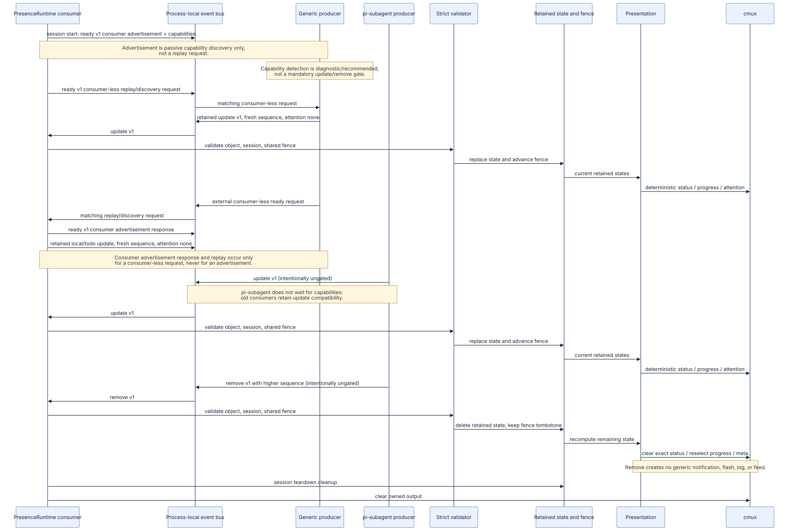

# `pi-presence:update:v1`·`pi-presence:remove:v1` 이벤트 계약

이 채널은 같은 Pi 프로세스 event bus의 선택적 presence 입력입니다. `update`는 상태를 기록하고 consumer-side `remove`는 이미 수락된 외부 source의 retained 상태를 철회합니다. durable transport나 cross-process API가 아니며 reload/세션 종료 후 생산자는 필요하면 현재 상태를 다시 발행해야 합니다.



이 이미지는 흐름 개요이며, 아래의 세부 계약을 대체하지 않습니다. Mermaid 원본: [`diagram/event-flow.mmd`](diagram/event-flow.mmd)

## 엄격한 V1 객체

payload와 중첩 객체에는 다음 키 외의 키를 넣을 수 없습니다. 모든 문자열(`sessionId`, `source.id`, `source.label`, `source.kind`, 선택 `progress.label`)은 1–96 Unicode code points이고 C0/C1 control, bidi·방향성 제어 문자를 포함할 수 없습니다.

```ts
{
  version: 1,
  sessionId: string,
  generation: number,
  sequence: number,
  source: { id: string, label: string, kind: string },
  state: "idle" | "waiting" | "running" | "success" | "error" | "cancelled",
  counts: {
    active: number,
    completed: number,
    failed: number,
    queued?: number,
    cancelled?: number,
    total?: number,
  },
  progress?: { value: number, label?: string },
  usage?: { tokens?: number, cost?: number, contextPercent?: number },
  attention?: "none" | "info" | "success" | "error",
}
```

| 필드 | 조건 |
| --- | --- |
| `version` | 정확히 `1` |
| `generation` | 안전한 정수 0–`Number.MAX_SAFE_INTEGER` |
| `sequence` | 안전한 정수 1–`Number.MAX_SAFE_INTEGER` |
| `counts.active/completed/failed` | 필수, 각각 안전한 정수 0–1,000,000 |
| `counts.queued/cancelled/total` | 선택·가산 필드, 있으면 각각 안전한 정수 0–1,000,000 |
| `progress.value` | finite number 0–1 |
| `usage.tokens`, `usage.cost` | 각각 finite number 0–1e12 |
| `usage.contextPercent` | finite number 0–100 |
| `attention` | 생략하거나 `none`/`info`/`success`/`error` |

가산 count는 기존 필수 count의 의미를 바꾸지 않습니다. 예를 들어 `waiting`은 producer가 대기 중임을 표현할 수 있고, `queued`·`cancelled`·`total`은 상태 문자열·meta 집계에 선택적으로 반영됩니다. consumer는 이 수치들 사이의 산술 관계를 강제하지 않습니다.

## 엄격한 V1 remove 객체

`pi-presence:remove:v1` payload와 `source` 중첩 객체는 아래 키만 정확히 허용합니다. `source.id`와 `sessionId`는 update와 같은 1–96 Unicode code points safe text 규칙(C0/C1 control 및 bidi·방향성 제어 문자 금지)을 따릅니다. plain object가 아니거나 getter/proxy 접근 중 예외가 발생하는 입력은 거부하며 parser는 예외를 외부로 전파하지 않습니다. remove에는 label, kind, state, count, progress, usage 또는 attention처럼 producer가 표시나 attention을 제어할 수 있는 필드가 없습니다.

```ts
{
  version: 1,
  sessionId: string,
  generation: number,
  sequence: number,
  source: { id: string },
}
```

| 필드 | 조건 |
| --- | --- |
| `version` | 정확히 `1` |
| `generation` | update와 같음: 안전한 정수 0–`Number.MAX_SAFE_INTEGER` |
| `sequence` | update와 같음: 안전한 정수 1–`Number.MAX_SAFE_INTEGER` |
| `source` | 정확히 `id`만 가지며, 추가 키를 허용하지 않음 |

## 순서, 예약 source, 신뢰 경계

consumer는 host가 제공한 session ID도 같은 1–96 Unicode code points safe text 규칙으로 먼저 검증합니다. 누락·조회 오류·범위 위반이면 lifecycle handler에서 예외를 전파하지 않고 해당 presence 세션을 fail-closed로 비활성화합니다. consumer는 현재 세션과 다른 `sessionId`를 무시합니다. update와 remove는 source별 마지막 `(generation, sequence)` fence를 **공유**합니다. 낮은 generation 또는 같은 generation의 같거나 낮은 sequence를 거부하고, 높은 generation은 그 source의 sequence fence만 다시 시작합니다. generation은 consumer가 아닌 producer가 소유합니다. 세션당 서로 다른 source는 최대 64개이며, remove가 source를 새로 만들지는 않습니다.

`source.id: "pi"`는 내장 Pi lifecycle producer, `source.id: "pi-todo"`는 내장 todo adapter의 예약값입니다. 외부 event bus payload가 이 둘을 쓰면 무시됩니다. 특히 remove는 이 예약 source를 철회할 수 없습니다. payload는 신뢰할 수 없는 구조화 입력으로 파싱·키·범위 검사를 통과해야 합니다. 생산자는 label, 수치와 attention에 비밀 또는 신뢰할 수 없는 원문을 넣지 않아야 합니다. consumer의 label 처리는 구조·control/bidi·길이 검증과 목적지별 축약이지 의미 기반 redaction이 아닙니다.

수락된 update는 해당 `source.id`의 retained 상태를 **대체**합니다. remove는 먼저 같은 source에 이미 fence가 있는지 확인하므로 unknown source의 remove는 거부합니다. 유효한 remove는 retained 상태가 있으면 그 상태만 삭제하고 `(generation, sequence)` fence는 tombstone으로 남깁니다. 따라서 삭제 뒤에는 더 높은 update만 source를 다시 활성화할 수 있습니다. tombstone을 향한 더 높은 유효 remove도 fence를 전진시킨 채 수락되지만, 삭제할 retained 상태가 없으므로 physical status clear는 보내지 않습니다. 반대로 retained 상태를 실제로 철회한 경우에만 그 source의 정확한 status key를 clear합니다. 새 세션 시작 또는 session shutdown의 teardown은 retained source의 소유 status를 정리합니다.

수락된 remove는 남은 retained 상태로 progress를 다시 선택하고, 공식 hook이 우선하지 않으며 `PI_CMUX_PRESENCE_META_BLOCK=true`인 경우 meta block도 다시 계산합니다. remove 자체는 generic `log`, notification, flash 또는 feed를 새로 만들지 않으며, 이미 만든 notification의 보존·dismiss는 계속 cmux 소유입니다. 정확한 `source.id: "pi-subagent"` remove는 누적 terminal baseline과 보류 burst를 무효화합니다. 그 burst 때문에 보류된 local parent attention이 있으면 producer payload를 복사하지 않는 local fallback을 기존 policy·capability gate로 처리합니다.

이 저장소는 consumer만 제공합니다. transient producer는 matching ready의 `presence-remove-v1` capability를 확인한 뒤 최초 retained update를 발행하는 것이 **권장**되며, 정상 답변·취소·abort·예외·shutdown의 종료 경로에서 더 높은 sequence로 remove하는 것이 안전합니다. 이는 mandatory gate가 아니다. 특히 `pi-subagent`는 이전 consumer 호환성을 위해 capability를 기다리지 않는 ungated update/remove를 의도적으로 발행하며, 그런 이전 consumer는 마지막 update를 session teardown까지 sticky하게 유지합니다. 열린 상태를 matching ready에 replay할 때는 새 sequence와 `attention: "none"`을 사용해야 하며, 이미 끝났다면 replay하지 않습니다. 동시 요청은 고정 source 하나에 `active`·`queued` count로 집계하고 마지막 요청이 끝날 때만 remove하는 방식을 권장합니다. prompt, 선택지, 답변, tool call ID, 경로, credential 또는 raw error는 update/remove에 넣지 않아야 합니다. 이 producer lifecycle은 외부 producer의 책임이며 이 저장소에 ask-user producer 구현이나 그 lifecycle 검증이 있다고 주장하지 않습니다. remove를 모르는 이전 consumer는 event를 구독하지 않아 무시할 수 있고, remove를 발행하지 않는 이전 producer의 마지막 update는 기존처럼 session teardown까지 retained됩니다.

## progress 선택과 상태 표시

cmux에는 전역 progress 슬롯 하나만 있습니다. `pi-todo`가 progress를 제공하면 state가 terminal이거나 value가 `1`이어도 그 todo가 최우선이며, 다음 todo update 또는 todo가 사라질 때까지 표시합니다. 그 외에는 `running` 또는 `waiting`이고 progress를 제공한 source 중 `source.id` 사전순 첫 항목을 선택합니다. 따라서 결과는 결정적이지만, source별 독립 progress bar는 없습니다.

각 source status는 SHA-256 기반 키로 기록됩니다. `set_status`는 workspace `--tab`과 surface `--panel`을 지정하며, 스타일은 `idle` gray/circle/priority 10, `waiting` amber/clock/20, `running` blue/play/30, `success` green/check/20, `error` red/x/40, `cancelled` gray/minus/20입니다.

`attention: "info" | "success" | "error"`는 log/notification/flash 요청입니다. V1 `log`는 `PI_CMUX_PRESENCE_LOG`만 충족하면 전송되고, V2 notification·flash는 레거시 kill switch, [`configuration.md`](configuration.md)의 policy 및 해당 V2 capability를 모두 충족할 때만 전송됩니다. `none` 또는 생략은 요청하지 않습니다. policy가 `background`여도 cmux focus나 foreground 여부를 검사하지 않으며, focus 기반 suppress는 지원하지 않습니다. local Pi cancellation과 정확한 `pi-subagent` producer cancellation은 status-only `attention: "none"`이다. 따라서 permissive한 `all` notification 또는 `attention` flash policy여도 notification·flash·attention log를 요청하지 않습니다.

### 정확한 `pi-subagent` source의 attention 집계

일반 producer는 위 attention을 즉시 독립적으로 처리합니다. 단, `source.label`이나 `source.kind`가 아니라 정확히 `source.id: "pi-subagent"`인 수락된 update에는 소비자 측 terminal 집계 정책이 적용됩니다. 이는 `pi-subagent`를 dependency로 만들거나 그 외부 구현의 lifecycle을 소유한다는 뜻이 아닙니다.

- `completed`·`failed`·`cancelled`의 **누적** count baseline을 같은 generation 안에서 비교합니다. success/info는 `completed`가 증가한 경우, error는 `failed`가 증가한 경우에만 terminal 후보가 됩니다. 취소 상태는 attention 후보가 아니며 `cancelled` 증가도 완료 attention을 만들지 않습니다.
- 처음 보거나 generation이 바뀐 non-`none` attention은 이전 누적 이력이 없으므로 count `0`의 unknown live signal로만 처리합니다. 어느 누적 count라도 감소하면 baseline을 새 값으로 교체하고, 그 update의 **terminal-attention 해석**과 쌓인 burst를 fail-closed로 버립니다. update 자체가 이미 수락되었으므로 status와 progress는 새 값으로 렌더링됩니다. 무효화된 burst가 local parent attention을 보류하고 있었다면 producer payload를 복사하지 않는 local fallback으로 복원합니다.
- success는 첫 success에서 시작하는 **고정 450ms**, error는 첫 error에서 시작하는 **고정 100ms** semantic window에서 같은 burst를 모읍니다. 부모 Pi가 활성이어도 window는 닫히며, 현재 같은 종류 window의 뒤따른 terminal은 deadline을 연장하지 않습니다. success 뒤 최초 error는 자체 고정 100ms window를 시작합니다. window가 닫힌 뒤 같은 부모 run·generation에 연결된 새 terminal은 새 고정 window를 시작할 수 있지만, 누적 delta는 같은 부모 aggregate에 계속 더해져 그 부모 settlement에서 notification 한 번으로 확정될 수 있습니다. error가 같은 aggregate의 success보다 우선합니다.
- 부모 settlement가 아직 열린 window 안에 들어오면 즉시 dispatch하지 않고 window가 닫힐 때까지 보류하여 그 안의 delta를 함께 처리합니다. 단, 이미 settle된 이전 부모 aggregate가 열린 채 다음 부모 run이 시작되면 lifecycle boundary에서 이전 aggregate를 dispatch해 run 간 결합을 막습니다. 활성 부모에 연결된 error는 window가 닫힌 뒤 settlement를 기다릴 수 있으나, 최초 error부터 10초가 상한이고 뒤늦은 semantic window도 이를 늦추지 않습니다. 10초 timeout이 한 번 dispatch하면 **그 부모 run만** fence하여 그 뒤의 같은 부모 settlement가 중복 native attention을 만들지 않게 하며, 다음 부모 run은 fence하지 않습니다. 부모가 비활성일 때 시작된 error는 독립적이므로 100ms 중에 부모가 시작해도 그 부모에 연결하거나 기다리지 않습니다.
- 이는 socket queue의 same-key latest-write-wins와 다른 **의미적 terminal coalescing**입니다. 전자는 아직 실행되지 않은 UI 요청의 전송 최적화이고, 후자는 누적 count와 lifecycle을 해석해 notification 수를 정하는 정책입니다.
- 성공한 child 집계와 성공한 부모가 실제 `agent_settled`(해당 hook을 지원하지 않는 host에서는 `agent_end` fallback)에서 관찰되어 함께 확정된 경우에만 notification title을 정확히 `Pi response ready`로 표시합니다. grace 또는 child success만으로 부모 결과·응답 준비를 주장하지 않습니다. 이 병합 성공은 policy 판정에서 generic external success가 아니라 finalized local completion으로 취급되므로 `settled` notification에서도 허용됩니다.

집계 notification의 고정 출력은 다음과 같습니다. count가 있으면 body는 `N completed`, `N failed`를 ` · `로 연결하고 producer label이나 payload text를 복사하지 않습니다.

| 상황 | title | body |
| --- | --- | --- |
| 독립/미병합 success | `Subagents completed` | count summary 또는 `Subagent task completed` |
| error | `Subagents need attention` | count summary 또는 `Subagent task failed` |
| 성공 부모와 병합 | `Pi response ready` | count가 있으면 `Subagents: <count summary>`, 없으면 `Subagent task completed` |
| 활성 부모 error 10초 timeout | `Subagent failed` | `<error summary> · Parent is processing results` |

공식 cmux hook이 우선할 때 이 exact source의 버퍼된 success는 native notification/flash로 보내지 않습니다(설정한 log는 가능). error 집계는 정책과 capability가 허용하면 한 번 계속 보냅니다. hook 감지는 비동기이지만 session epoch와 session ID로 fence하므로, 이전 세션의 지연된 probe 결과가 현재 세션의 precedence를 바꾸지 않습니다. 다른 외부 source에는 이 special policy를 적용하지 않습니다.

`PI_CMUX_PRESENCE_FINAL_CLEAR_MS`는 내장 `pi` source의 `agent_settled` 뒤 최종 status를 지우기까지의 대기 시간만 제어합니다. 이 타이머는 외부 source의 retained 상태를 지우지 않으며, 외부 상태는 수락된 remove 또는 session teardown까지 남을 수 있습니다.

## ready 광고와 재발행

consumer는 session 시작 뒤 `pi-presence:ready:v1` consumer advertisement를 발행합니다. `consumer`의 존재 여부는 엄격한 V1 wire shape 안에서 request/response 방향을 구분합니다.

```ts
{
  version: 1,
  sessionId: string,
  consumer?: {
    id: string,             // 1–96 Unicode code points safe text
    capabilities: string[], // 각 safe text, 최대 16개
  },
}
```

현재 consumer advertisement는 `id: "pi-cmux-presence"`, capabilities `cmux-status`, `cmux-progress`, `cmux-attention`, `presence-remove-v1`입니다. session startup은 이 frozen advertisement를 먼저 한 번 내고, 이어 frozen consumer-less request를 정확히 한 번 냅니다. consumer는 자기 request의 exact object identity를 무시하므로 local/todo를 자기 자신에게 replay하지 않습니다.

`consumer`가 **없는** 유효한 matching-session ready는 replay/discovery **request**다. 활성 consumer는 외부 request 하나에 frozen advertisement 하나를 best-effort로 응답한 뒤 retained local `pi`/`pi-todo` state를 각각 새 sequence 및 `attention: "none"`으로 정확히 한 번 replay한다. `consumer`가 **있는** 유효한 ready는 passive consumer **advertisement**일 뿐이며 consumer는 response하거나 local/todo replay를 해서는 안 된다. 따라서 여러 producer/consumer의 advertisement가 replay fan-out을 만들지 않는다. consumer는 자신의 advertisement/request identity를 parsing 전에 무시하고, response 중 nested request도 무시한다. malformed·stale·비활성 session event는 무시한다.

일반 producer는 matching consumer-less request에 retained state를 새 sequence 및 `attention: "none"`으로 replay할 수 있다. replay는 현재 status를 복원할 뿐 과거 성공·error를 다시 notification/flash하지 않는다. startup advertisement/request는 producer-first load order를, 외부 request에 대한 consumer response는 consumer-first load order를 보정한다. event emit 실패는 이 선택적 discovery 응답과 replay를 Pi 작업의 실패로 바꾸지 않는다. ready root, consumer, capability array 및 consumer request는 frozen output이며 mutation observer가 protocol state를 바꾸지 못한다.

## RPIV todo 진행률

내장 `pi-todo` adapter는 성공한 `todo` tool result의 RPIV `TaskDetails` envelope만 다룹니다. `pi.getAllTools()`에서 정확히 하나인 `todo`의 `sourceInfo.path/source/scope/origin` 조합을 provenance로 고정하고, 이후 동일 provenance가 아니면 거부합니다.

`TaskDetails`는 unknown key나 accessor를 허용하지 않고 정확히 `action`, `params`, `tasks`, `nextId`, 선택 `error`만 받습니다. `action`은 필수 문자열이며 UTF-16 code unit 기준 최대 64자, `params`는 필수 plain object, `tasks`는 필수 배열, `nextId`는 1 이상 `Number.MAX_SAFE_INTEGER` 이하의 필수 정수입니다. `params`와 선택 `error`의 안전 트리는 객체당 최대 32개 own data field, 배열당 최대 256개 항목을 허용하며 컨테이너 중첩 깊이 4에서 추가 컨테이너를 거부합니다.

task는 최대 256개이며 task object도 최대 32개의 own data field와 현재 allowlist(`id`, `status`, `content`, `subject`, `title`, `description`, `activeForm`, `priority`, `tags`, `metadata`, `createdAt`, `updatedAt`, `completedAt`, `dueDate`, `dependsOn`, `blockedBy`, `owner`)만 허용합니다. `id`와 `status`만 의미 데이터로 읽으며 `pending`, `in_progress`, `completed`, `deleted` 상태와 고유 양의 ID만 받아들입니다. ID 고유성은 visibility와 무관하게 deleted task를 포함한 전체 배열에서 검사합니다. 이 strict boundary를 벗어나면 todo progress update 전체를 best-effort로 생략합니다.

`deleted` task는 ID 검증 뒤 visible total과 모든 count에서 제외됩니다. `in_progress`는 `active`, `completed`는 `completed`, 나머지 visible pending은 `queued`가 됩니다. visible task가 없으면 `idle`, active가 있으면 `running`, 모두 completed면 `success`, 그 외에는 `waiting`입니다. visible task가 있을 때만 `completed / visible` progress를 만듭니다.

adapter는 task `content`, `subject`, `title`, `description`, `activeForm`, metadata와 tool result text를 읽거나 보관하거나 event payload에 복사하지 않습니다. 따라서 todo progress는 count와 비텍스트 state만 보이며 task 내용은 cmux로 전송되지 않습니다.

## 일반 생산자 예시

```ts
pi.events.emit("pi-presence:update:v1", {
  version: 1,
  sessionId: ctx.sessionManager.getSessionId(),
  generation: 1,
  sequence: 3,
  source: { id: "indexer", label: "Indexer", kind: "background" },
  state: "waiting",
  counts: { active: 0, completed: 12, failed: 0, queued: 2, total: 14 },
  attention: "info",
});
```

`progress`·`usage`는 producer가 실제로 제공할 때만 넣습니다. consumer는 이를 추정하지 않습니다. 다만 attention 집계에는 위 절의 정확한 `source.id: "pi-subagent"` 예외가 있으며, 그 외 외부 producer에는 source별 generic 규칙을 적용합니다.

## 로컬 턴 표시와 settled 정책

내장 `pi` source는 event payload의 assistant response body·preview, user prompt, raw error, path 또는 tool content를 sidebar/notification에 추가하지 않습니다. 상태별 고정 summary는 `Idle`, `Waiting`, `Writing response`, `Response ready`, `Needs attention`, `Cancelled`이며 sidebar는 각각 `Pi · <summary>`, notification은 title `Pi`와 같은 summary body를 사용합니다.

`agent_end`는 terminal reason을 기록할 뿐입니다. settlement를 의미하는 `agent_settled`가 도착해야 local terminal event가 확정됩니다. hook context가 `isIdle()`을 제공해 `false`를 반환하면 확정하지 않지만, context나 함수가 없으면 hook 자체를 settlement 증거로 사용합니다. host가 `agent_settled` 등록을 거부한 경우에만 `agent_end` fallback을 씁니다. `PI_CMUX_PRESENCE_NOTIFY_POLICY=settled`는 이 확정 local success/error와 external error를 notification 대상으로 하고 generic external info/success는 제외합니다. 단, 성공 부모 settlement와 exact `pi-subagent` 성공 집계의 병합은 finalized local completion으로 허용합니다. legacy kill switch, policy, V2 capability 및 official-hook precedence의 전체 gate는 [`configuration.md`](configuration.md)를 따릅니다. local terminal status는 `PI_CMUX_PRESENCE_FINAL_CLEAR_MS` 뒤 clear되며 notification 보존은 cmux 소유입니다.
